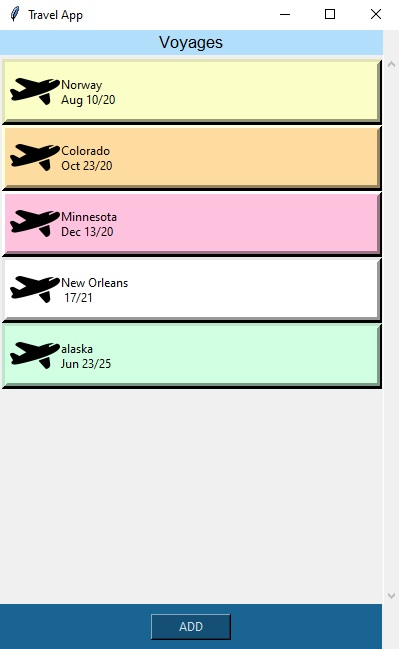

# TravelApp-GUI
Travel plans/budget tracker with GUI

Currently fully functional with the basics. Is not stylized yet though.

to run, make sure you have pickle installed.
download TravelApp2.py
then in command line, navigate to file location,
run python TravelApp2.py
It will generate a tkinter window frame and
create a pkl file that will save/read your travel info.

Based off the code of my other travel app which runs with Command Line Interface, This is aimed at being functional with a GUI.
My first one!

Page that displays an individual trips details including current budget and itinerary sorted by date and time

Page for creating and editing details to a trip cost, dynamic input fields based on cost type

Main Page of app, displays trips and a button to create a new trip

